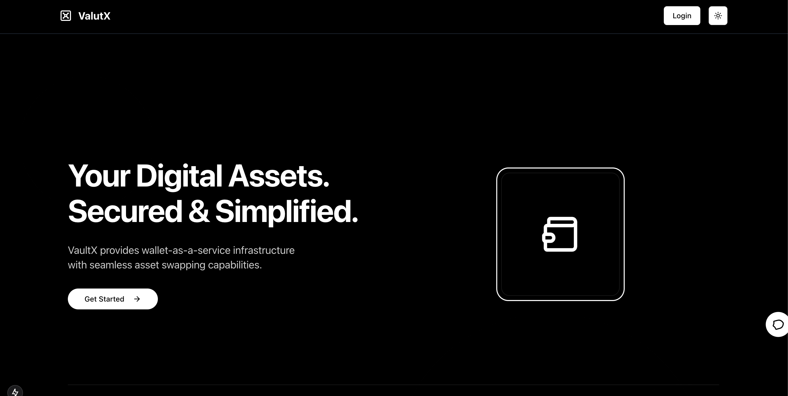

# VaultX

VaultX is a Web3-powered Wallet-as-a-Service (WaaS) platform that provides seamless asset management and swapping capabilities. Built with **Next.js**, VaultX offers a secure and user-friendly experience for interacting with digital assets.

## Features

- **Wallet-as-a-Service**: Easily create and manage Web3 wallets.
- **Asset Swapping**: Swap cryptocurrencies securely within the platform.
- **Next.js Framework**: Fast, optimized, and scalable.
- **Secure & Decentralized**: Built with security best practices and Web3 principles.

## Getting Started

### Prerequisites

Ensure you have the following installed:

- **Node.js** (v16+ recommended)
- **Yarn** or **npm**

### Installation

Clone the repository and install dependencies:

```bash
git clone https://github.com/yourusername/vaultx.git
cd vaultx
npm install # or yarn install
```

### Environment Setup

Create a `.env.local` file in the root directory and configure your environment variables:

```env
NEXT_PUBLIC_INFURA_API_KEY=your_infura_key
NEXT_PUBLIC_ALCHEMY_API_KEY=your_alchemy_key
NEXT_PUBLIC_WALLET_SERVICE_API=your_wallet_service_endpoint
```

### Running the Application

Start the development server:

```bash
npm run dev # or yarn dev
```

The app will be available at [http://localhost:3000](http://localhost:3000).

## Deployment

VaultX can be deployed on **Vercel** or any Next.js-compatible hosting provider.

Deploy with Vercel:

```bash
npm run build
vercel deploy
```

## Tech Stack

- **Frontend**: Next.js, React
- **Blockchain**: Web3.js / ethers.js
- **Backend**: Node.js (if applicable)
- **Infrastructure**: Infura, Alchemy

## Contributing

We welcome contributions! Please follow these steps:

1. Fork the repository.
2. Create a new branch (`feature/your-feature`).
3. Commit and push your changes.
4. Open a pull request.

## Contact

For any inquiries, reach out at [your-email@example.com](mailto:your-email@example.com) or open an issue on GitHub.
